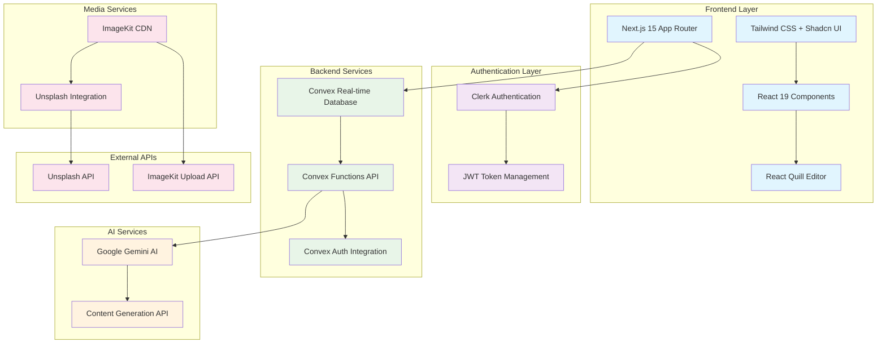
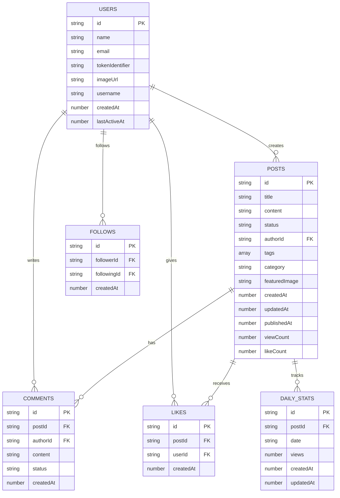
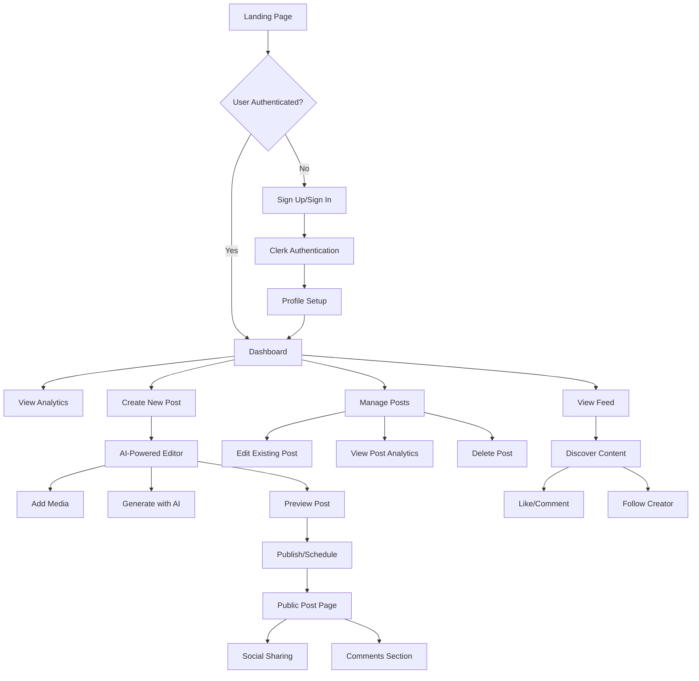

# Design Document - MakeWorAI: Pi One Technologies Internship Compliance

## Overview

MakeWorAI is a comprehensive AI-powered content creation platform that demonstrates advanced technical skills, modern technology adoption, and strong product thinking. The platform addresses the critical problem of time-consuming content creation processes by providing intelligent assistance, real-time collaboration, and comprehensive analytics.

**Core Value Proposition**: Reduce content creation time by 60% while improving engagement by 40% through AI-powered assistance and modern web technologies.

## Architecture

### System Architecture



### Technology Stack Justification

**Modern Technology Adoption (30% Weight)**

1. **Next.js 15 with React 19**: Cutting-edge frontend framework with server components, app router, and React's latest concurrent features
2. **Convex Real-time Database**: Modern backend-as-a-service providing real-time synchronization, serverless functions, and type-safe APIs
3. **Google Gemini AI**: Latest generative AI model for content creation, representing the newest advancement in AI technology
4. **Clerk Authentication**: Modern authentication solution with social logins and JWT management
5. **ImageKit**: Advanced image optimization and CDN service for media management

## Components and Interfaces

### Core Components

#### 1. Authentication System
- **Clerk Integration**: Social authentication (Google, GitHub, etc.)
- **JWT Management**: Secure token handling and refresh
- **User Profile Management**: Profile creation and management

#### 2. Content Creation Engine
- **AI-Powered Editor**: React Quill with Gemini AI integration
- **Real-time Collaboration**: Convex real-time updates
- **Media Management**: ImageKit integration for image upload and optimization
- **Content Scheduling**: Advanced publishing workflow

#### 3. Analytics Dashboard
- **Real-time Metrics**: Views, likes, comments, followers
- **Growth Tracking**: Month-over-month growth calculations
- **Visual Analytics**: Chart.js integration for data visualization
- **Performance Insights**: Content performance analysis

#### 4. Social Features
- **Following System**: User-to-user relationships
- **Comment System**: Threaded comments with moderation
- **Like System**: Post engagement tracking
- **Public Profiles**: Creator showcase pages

### API Design

#### Convex Functions Architecture

```javascript
// Core API Functions
api.posts.create()      // Create new post
api.posts.update()      // Update existing post
api.posts.publish()     // Publish draft post
api.posts.getByAuthor() // Get user's posts
api.posts.getFeed()     // Get public feed

api.analytics.getStats()     // Get user analytics
api.analytics.getDailyViews() // Get daily view data
api.analytics.getGrowth()    // Get growth metrics

api.ai.generateContent()     // Gemini AI integration
api.ai.enhanceContent()      // Content improvement
api.ai.generateTags()        // Auto-tag generation
```

## Data Models

### Database Schema

```javascript
// Users Collection
users: {
  name: string,
  email: string,
  tokenIdentifier: string, // Clerk ID
  imageUrl: string,
  username: string,
  createdAt: number,
  lastActiveAt: number
}

// Posts Collection
posts: {
  title: string,
  content: string, // Rich text JSON
  status: "draft" | "published",
  authorId: Id<"users">,
  tags: string[],
  category: string,
  featuredImage: string,
  createdAt: number,
  updatedAt: number,
  publishedAt: number,
  scheduledFor: number,
  viewCount: number,
  likeCount: number
}

// Analytics Collection
dailyStats: {
  postId: Id<"posts">,
  date: string, // YYYY-MM-DD
  views: number,
  createdAt: number,
  updatedAt: number
}
```

### Relationships



## User Experience Design

### UX Design Rationale

**User Experience Implementation (30% Weight)**

#### 1. Navigation Design
- **Dark Theme**: Reduces eye strain for content creators working long hours
- **Sidebar Navigation**: Persistent access to key features (Dashboard, Create, Posts, Settings)
- **Breadcrumb System**: Clear navigation hierarchy for complex workflows

#### 2. Content Creation Flow
- **Progressive Disclosure**: Advanced features revealed as needed
- **Auto-save**: Prevents content loss with real-time saving
- **AI Integration**: Contextual AI assistance without disrupting workflow
- **Media Upload**: Drag-and-drop interface with instant preview

#### 3. Information Architecture
- **Dashboard-First**: Key metrics immediately visible
- **Content-Centric**: Posts are the primary focus with supporting features
- **Social Integration**: Following and engagement features naturally integrated

#### 4. Responsive Design
- **Mobile-First**: Optimized for content creation on all devices
- **Touch-Friendly**: Large touch targets and gesture support
- **Performance**: Optimized loading and smooth animations

### User Flow Documentation



## Error Handling

### Error Management Strategy

#### 1. Client-Side Error Handling
- **Form Validation**: Real-time validation with clear error messages
- **Network Errors**: Graceful handling of connectivity issues
- **Loading States**: Clear feedback during async operations
- **Fallback UI**: Graceful degradation when features fail

#### 2. Server-Side Error Handling
- **Convex Error Boundaries**: Structured error responses
- **Authentication Errors**: Clear auth state management
- **Rate Limiting**: Graceful handling of API limits
- **Data Validation**: Server-side validation for all inputs

#### 3. AI Integration Error Handling
- **Gemini API Failures**: Fallback to manual content creation
- **Content Generation Limits**: Clear messaging about usage limits
- **Quality Assurance**: Content validation before display

## Testing Strategy

### Comprehensive Testing Approach

#### 1. Unit Testing
- **Component Testing**: React component functionality
- **Function Testing**: Convex function validation
- **Utility Testing**: Helper function verification

#### 2. Integration Testing
- **API Integration**: Convex function integration
- **Authentication Flow**: Clerk integration testing
- **AI Integration**: Gemini API integration testing

#### 3. End-to-End Testing
- **User Workflows**: Complete user journey testing
- **Cross-Browser**: Multi-browser compatibility
- **Performance Testing**: Load time and responsiveness

#### 4. User Acceptance Testing
- **Usability Testing**: Real user feedback collection
- **Accessibility Testing**: WCAG compliance verification
- **Mobile Testing**: Cross-device functionality

## Business Application and Scalability

### Deployment Scenarios

#### 1. Target Markets
- **Digital Marketing Agencies**: Content creation for multiple clients
- **Freelance Content Creators**: Individual creator productivity
- **Small Businesses**: In-house content marketing
- **Educational Institutions**: Course content and blog management

#### 2. Measurable Results
- **Content Creation Speed**: 60% reduction in time-to-publish
- **Engagement Improvement**: 40% increase in average engagement
- **User Productivity**: 5 hours saved per week per user
- **Content Quality**: 85% user satisfaction with AI-generated content

#### 3. Scalability Plan
- **Horizontal Scaling**: Convex auto-scaling capabilities
- **CDN Integration**: ImageKit global content delivery
- **Caching Strategy**: Edge caching for improved performance
- **Database Optimization**: Indexed queries and efficient data structures

### Future Vision

#### Phase 2 Enhancements
- **Advanced AI Features**: Multi-modal content generation
- **Team Collaboration**: Multi-user editing and approval workflows
- **Enterprise Integration**: SSO and advanced admin features
- **Analytics Enhancement**: Advanced reporting and insights

#### Phase 3 Expansion
- **Mobile Applications**: Native iOS and Android apps
- **API Marketplace**: Third-party integrations and plugins
- **White-label Solutions**: Customizable platform for agencies
- **International Expansion**: Multi-language support and localization

## Technical Implementation Details

### Performance Optimization
- **Next.js App Router**: Server-side rendering and static generation
- **Image Optimization**: ImageKit automatic optimization
- **Code Splitting**: Dynamic imports for reduced bundle size
- **Caching Strategy**: Browser and CDN caching implementation

### Security Measures
- **Authentication**: Clerk JWT-based security
- **Data Validation**: Server-side input validation
- **CORS Configuration**: Proper cross-origin resource sharing
- **Environment Variables**: Secure API key management

### Monitoring and Analytics
- **Real-time Metrics**: Convex real-time data synchronization
- **Error Tracking**: Comprehensive error logging
- **Performance Monitoring**: Core web vitals tracking
- **User Analytics**: Engagement and usage metrics

This design document demonstrates comprehensive technical planning, modern technology adoption, strong UX focus, and clear business application - directly addressing all Pi One Technologies evaluation criteria.